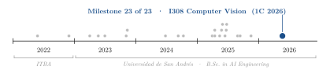
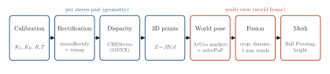
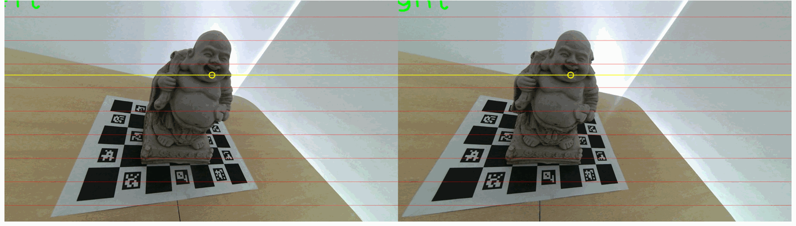
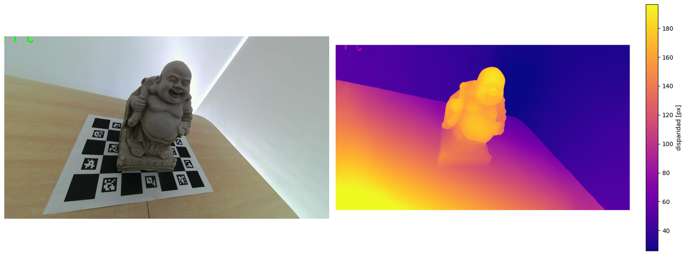
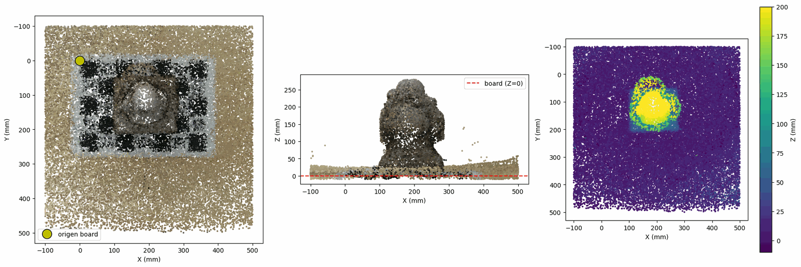
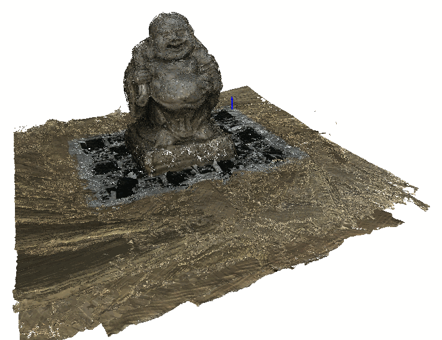

<div align="center">

# Stereo 3D Reconstruction of a Ceramic Buddha

**Santiago Groba Alonso** · Valentino Nallib Fadel · [Joaquín Gustavo Di Cola](https://github.com/joaco1212004)

Universidad de San Andrés · *Computer Vision (I308)* · First semester 2026 · Assignment 2

[](#reproducing-the-results)
[](#reproducing-the-results)

<picture>
  <source media="(prefers-color-scheme: dark)" srcset="docs/figures/trajectory-dark.svg">
  
</picture>

</div>

> **Abstract.** We reconstruct a ceramic Buddha statue as a metric point cloud from stereo image pairs taken around it. Each stereo pair is rectified, a dense disparity map is computed with the CREStereo network, depth follows from $Z = fB/d$, and the camera pose relative to a ChArUco board under the statue, estimated from the individual ArUco markers with PnP, brings every partial cloud into one world frame. On the course dataset (21 pairs at 1920×1080, baseline 60.4 mm) every pair was registered; the fused cloud has 15.1 million points, 3.3 million after outlier removal and a 1 mm voxel grid, and a Ball Pivoting mesh of 2.6 million triangles. The statue measures 280.1 mm above the board in the reconstruction. We also calibrated the camera from scratch on images we captured ourselves (161 of 163 chessboard pairs detected, stereo reprojection RMS 0.90 px), but the marker board in those captures was detected in too few views for a usable fusion.

---

## 1. Problem

The assignment (the PDF statement in the repository root, Spanish) asks for a 3D point cloud of a rigid object, as complete as possible, from RGB image pairs of the stereo camera ELP-USB3D1080P02-H120:

1. for each pair, compute depth with epipolar geometry, stereo rectification and disparity, and turn it into a point cloud;
2. use a known object in the scene (a checkerboard or a ChArUco board) to recover the camera pose with respect to a world frame in every view;
3. merge the partial clouds in that frame and estimate the size of the object in metric units.

The course provides two datasets of a Buddha statue (one with a checkerboard, one with a ChArUco board for 360° coverage), each with its own calibration images; capturing an own dataset was optional.

## 2. Methods

<p align="center"></p>

**Figure 1.** Reconstruction pipeline. The first four steps run on each stereo pair; the last three combine all views in the board frame.

| Component | Choice |
|---|---|
| Calibration | Course dataset: the provided `stereo_calibration.npz`. Own dataset: chessboard with 6×9 inner corners and 30 mm squares, `calibrateCamera` per camera, then `stereoCalibrate` with fixed intrinsics on 40 evenly spaced views |
| Rectification | `stereoRectify` (alpha 0), `initUndistortRectifyMap` and `remap`; rectified focal length 614.5 px, baseline 60.38 mm |
| Disparity | CREStereo (course `disparity` package, ONNX model `crestereo_combined_iter5_720x1280`), on 1280×720 inputs |
| 3D points | $Z = fB/d$, $X = (u - c_x)Z/f$, $Y = (v - c_y)Z/f$ in the rectified left camera; depths outside 100–2000 mm discarded; colors from the left image |
| World pose | ChArUco board 5×7, `DICT_6X6_250`, 52.6 mm squares, 31.3 mm markers. The statue hides most chessboard corners, so each detected ArUco marker is matched to its 3D corners on the board and the pose is solved with `solvePnP` on all of them |
| Fusion | Rectified → camera ($R_1^\top$) → world (inverse board pose); crop to $X, Y \in [-100, 500]$ mm, $Z \in [-10, 300]$ mm; statistical outlier removal (20 neighbours, 2σ); 1 mm voxel down-sampling (Open3D) |
| Surface and size | Normals with consistent orientation and Ball Pivoting (radii 1–3 mm) on the points more than 3 mm above the board; height = highest point more than 5 mm above the board inside a 160 mm square around the statue |

## 3. Results

The course dataset is not versioned in this repository, so Figures 2–4 and the numbers below are the outputs saved in `reconstruccion_3d_catedra.ipynb`.

### 3.1 Rectification and disparity

<p align="center"></p>

**Figure 2.** Rectified pair 0 (left and right) with horizontal lines. A point on the statue at $(1012, 364)$ in the left image (yellow) is found by template matching at column 842 of the same row in the right image (normalized correlation 0.982), a disparity of 170 px.

<p align="center"></p>

**Figure 3.** Rectified left image of pair 0 and its CREStereo disparity in pixels. The map is dense (every pixel has a value) and ranges from 22.0 to 210.4 px, mean 90.0 px, which corresponds to depths of about 176–1686 mm. The statue stands out with sharp borders against the table, whose disparity decreases smoothly with distance.

### 3.2 Pose and fusion

In pair 0, seven markers are visible around the statue, which gives 28 point correspondences for PnP; the board origin lies at a depth of 530 mm from the left camera. All 21 pairs of the dataset were registered.

<p align="center"></p>

**Figure 4.** Fused cloud in the board frame (50,000 random points shown): top view with colors (origin at the board corner), side view along $X$ with the board plane at $Z = 0$, and top view colored by height. The table surface is not perfectly flat in the fused cloud: it rises towards the edge of the crop box at $X = 500$ mm.

**Table 1.** Fusion on the course dataset.

| Quantity | Value |
|---|---:|
| Stereo pairs registered | 21 / 21 |
| Points after cropping, all pairs | 15,125,181 |
| After statistical outlier removal | 15,006,384 |
| After 1 mm voxel down-sampling | 3,313,168 |
| Statue points (above the board) | 2,887,120 |
| Ball Pivoting mesh | 2,887,120 vertices, 2,596,935 triangles |
| Height of the statue above the board | **280.1 mm** |

<p align="center"></p>

**Figure 5.** Open3D view of the reconstruction of the course dataset, with the world $Z$ axis in blue. Screenshot taken during development (recovered from the repository history).

### 3.3 Own dataset

**Table 2.** Calibration and registration on the images we captured (`datasets/stereo_propio/`, notebook `reconstruccion_3d.ipynb`).

| Quantity | Value |
|---|---:|
| Calibration pairs with the chessboard found in both images | 161 / 163 |
| Reprojection RMS, left / right camera (40 views) | 0.465 / 0.488 px |
| Stereo reprojection RMS | 0.900 px |
| Baseline $\lVert T\rVert$ (manufacturer: about 60 mm) | 63.23 mm |
| Captures with AprilTag markers detected (2× upsampling) | 14 / 39 |
| Captures containing the anchor marker | 8 / 39 |

The calibration is good, but the marker board in our captures (AprilTag 36h11, layout not documented) was detected only in a few views, and without the layout the pose could only be anchored to a single marker. The 8 usable views come from similar angles and the fused cloud (199,472 points) does not form a recognizable object, so the course dataset was used for the final reconstruction.

## 4. Takeaways

- Registration, not depth, was the bottleneck. Dense learned disparity worked on every pair (the project first used SGBM with CLAHE and a WLS filter and then switched to CREStereo), while the quality of the fusion depended on seeing enough markers with a known layout in every view.
- Using the individual ArUco markers of the ChArUco board instead of its interpolated corners makes the pose robust to the object occluding the center of the board.
- A sub-pixel calibration is not enough by itself: on our own captures the calibration was fine, but without a reliably detectable reference board there is no common frame to merge the views.

## Reproducing the results

```bash
python -m venv .venv && source .venv/bin/activate
pip install -r requirements.txt
mkdir -p "ejemplos clase" && cp -r code_examples/stereodemo_disp_example/disparity "ejemplos clase/"
# copy the course dataset to datasets/stereo_budha_charuco/ (captures/ and stereo_calibration.npz)
jupyter lab reconstruccion_3d_catedra.ipynb      # run all cells; CREStereo's ONNX model is downloaded to models/
python docs/figures/make_figures.py              # re-exports Figures 1–5 from the notebook and the git history
```

The notebooks import the course `disparity` package from `ejemplos clase/`, which is not versioned; the same package is in `code_examples/stereodemo_disp_example/`. The course datasets come from the course campus and are excluded by `.gitignore`; our own dataset is included.

| File | Content |
|---|---|
| `reconstruccion_3d_catedra.ipynb` | Main deliverable: full pipeline on the course ChArUco dataset, PLY export, mesh and viewer |
| `reconstruccion_3d.ipynb` | Pipeline on our own dataset: calibration from scratch, marker dictionary search, attempted fusion |
| `calib.py`, `aruco.py` | Calibration and ChArUco helpers provided by the course |
| `code_examples/` | Course examples: ChArUco pose and the `disparity` package (CREStereo and other methods) |
| `datasets/stereo_propio/` | Our captures: 163 calibration pairs, 39 object pairs, `stereo_calibration.pkl` and `stereo_maps.pkl` |
| `I308 Vision Artificial - TP2 - *.pdf` | Assignment statement (Spanish) |
| `docs/figures/` | Script and style used for the figures in this README |

## Acknowledgements

The I308 teaching staff provided the datasets, the calibration helpers, the [i308-calib](https://github.com/udesa-vision/i308-calib) tool and the code examples; the `disparity` package wraps CREStereo (Li et al., CVPR 2022) as packaged in N. Burrus's [stereodemo](https://github.com/nburrus/stereodemo).

## Citation

```bibtex
@misc{groba2026stereo,
  author       = {Groba Alonso, Santiago and Fadel, Valentino Nallib and Di Cola, Joaqu{\'i}n Gustavo},
  title        = {Stereo 3D Reconstruction of a Ceramic Buddha},
  year         = {2026},
  howpublished = {Universidad de San Andr{\'e}s, Computer Vision (I308)},
  url          = {https://github.com/Santi2065/udesa-i308-tp2-reconstruccion-3d}
}
```
